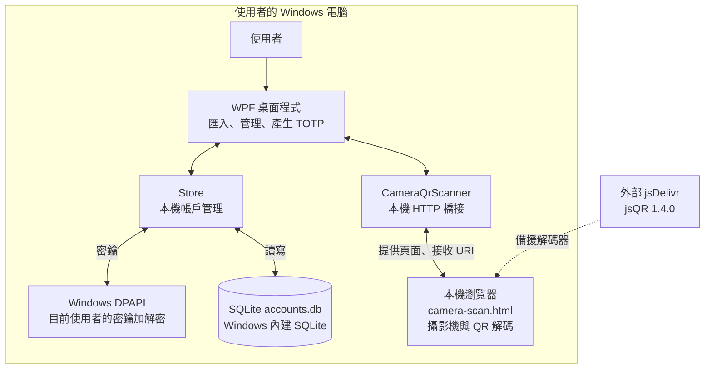
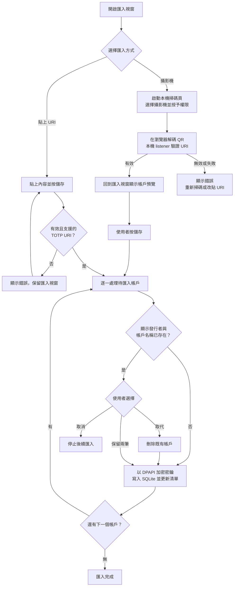
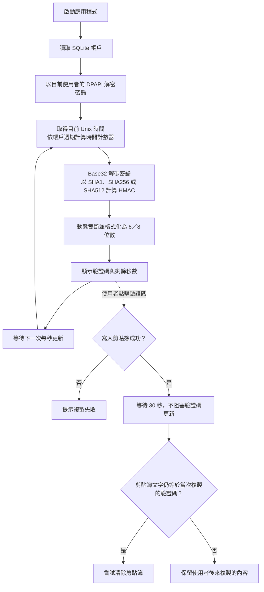
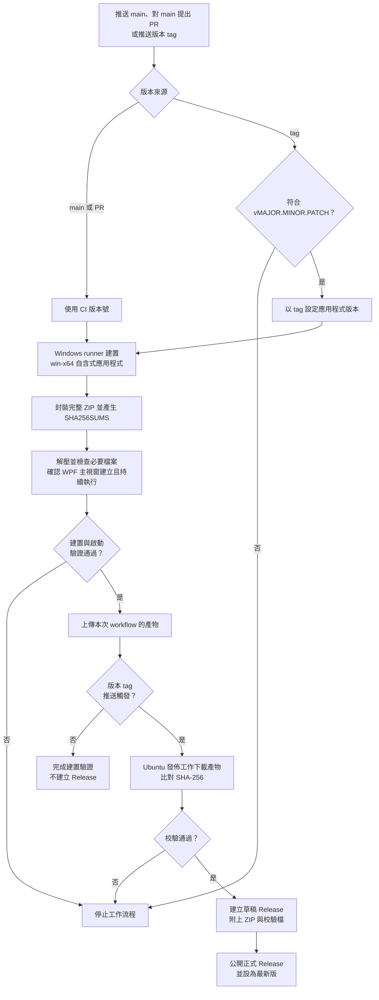

# Windows OTP Manager

以 .NET 8 與 WPF 開發的 Windows 本機一次性密碼管理器，不需要後端服務或雲端帳號。

- **TOTP 驗證碼**：支援 SHA1、SHA256、SHA512，以及 6／8 位數。
- **帳戶匯入**：貼上 `otpauth://totp` URI，或使用攝影機掃描 QR Code；支援 Google Authenticator 移轉 QR Code 中的 TOTP 帳戶。
- **本機儲存**：使用 SQLite 保存帳戶，密鑰以目前 Windows 使用者範圍的 DPAPI 加密。
- **日常操作**：搜尋、刪除帳戶、點擊驗證碼複製，以及通知區的開啟、隱藏與結束功能。

## 下載與執行

1. 前往 [GitHub Releases](https://github.com/louis70109/OTP-manager/releases/latest)，下載 Windows x64 ZIP 與 `SHA256SUMS`。
2. **解壓縮完整 ZIP**，保留所有檔案的相對位置。
3. 執行 `WindowsOtpManager.exe`。封裝已包含 .NET 執行階段，不需要另外安裝 .NET。

請使用仍受 Microsoft 支援的 Windows x64 版本。這是**未簽章、免安裝的應用程式**，不是安裝程式；Windows SmartScreen 可能提示未知發行者。目前不提供自動更新。

可在 PowerShell 計算下載檔案的 SHA-256，並與 `SHA256SUMS` 比對：

```powershell
Get-FileHash .\WindowsOtpManager-v1.0.0-win-x64.zip -Algorithm SHA256
```

校驗碼用來確認檔案完整性，不等同於發行者身份驗證或程式碼簽章。

## 系統架構圖

應用程式、瀏覽器掃碼頁與帳戶資料都在本機執行或保存。掃碼優先開啟 Edge，否則使用預設瀏覽器；頁面由 `127.0.0.1` 的隨機連接埠與路徑提供，只回傳辨識出的 URI，不傳送影像。唯一的執行期外部下載是瀏覽器缺少原生 `BarcodeDetector` 時，載入 jsQR 的備援路徑；產生既有帳戶的 TOTP 不需要連線。



| 元件 | 程式位置 | 職責 |
| --- | --- | --- |
| 主視窗與帳戶協調 | `MainWindow.xaml`、`MainWindow.xaml.cs` | 呈現帳戶、搜尋、重複帳戶處理、複製、刪除與通知區操作。 |
| URI 解析與 TOTP | `MainWindow.xaml.cs` 中的 `OtpUri`、`Row`、`Totp` | 解析匯入資料，每秒更新驗證碼與剩餘秒數。 |
| 匯入介面 | `ImportWindow.xaml`、`ImportWindow.xaml.cs` | 接收 URI、啟動掃碼、顯示掃碼結果並交回匯入帳戶。 |
| 瀏覽器掃碼橋接 | `CameraQrScanner.cs`、`camera-scan.html` | 提供本機掃碼頁，將辨識出的 URI 傳回桌面程式。 |
| 帳戶儲存 | `MainWindow.xaml.cs` 中的 `Store` | 決定資料庫路徑，協調帳戶讀寫與密鑰加解密。 |
| Windows 原生介接 | `NativeWindowsStorage.cs` | 透過 P/Invoke 呼叫 Windows SQLite 與 DPAPI。 |

圖中的元件是現有程式的職責劃分，不代表各自獨立的服務或專案。

## 操作流程圖

### 帳戶匯入與掃碼

貼上 URI 時，按下儲存才解析內容；掃碼時，瀏覽器辨識出的 URI 先經本機 listener 驗證，再回到匯入視窗顯示預覽，等待使用者儲存。



- 重複判斷不區分大小寫。發行者為空時，以帳戶名稱作為顯示發行者。
- URI 支援一般 `otpauth://totp` 與 `otpauth-migration://offline` 中支援的 TOTP 帳戶，不支援 HOTP。
- 匯入是**複製**，不會刪除來源驗證器中的帳戶。
- 多帳戶匯入採逐筆處理，**不是整批交易**；取消或儲存失敗不會復原先前已完成的變更。取代操作也會先刪除舊帳戶，再寫入新帳戶。
- 若掃碼預覽後另貼入非空 URI，儲存時會優先解析貼上的內容。

### 驗證碼產生與複製



驗證碼由本機系統時間計算，不向伺服器索取。每秒刷新畫面不代表驗證碼每秒變更；驗證碼依各帳戶設定的週期變更。剪貼簿清除不涵蓋 Windows 剪貼簿歷程、同步副本或其他程式已讀取的內容。

## 從原始碼建置

在 Windows 安裝 [.NET 8 SDK](https://dotnet.microsoft.com/download/dotnet/8.0)，於專案根目錄執行：

```powershell
dotnet restore
dotnet build
dotnet run
```

`global.json` 會選擇已安裝的最新穩定 .NET 8.0 SDK，避免使用其他主版本的 SDK。

## 資料儲存與安全邊界

- **資料位置**：預設為 `%LOCALAPPDATA%\WindowsOtpManager\accounts.db`。若無法初始化該位置，會改用專案根目錄或執行檔旁的 `Data` 目錄。
- **加密範圍**：只有密鑰欄位使用 DPAPI 加密；發行者、帳戶名稱、演算法、位數與週期仍是明文，不是整個資料庫加密。
- **使用者綁定**：DPAPI 綁定 Windows 使用者環境。複製資料庫到其他使用者或電腦，不是受支援的備份或移轉方式；免安裝 ZIP 不代表帳戶資料可攜。
- **執行期密鑰**：程式產生驗證碼時必須解密密鑰。DPAPI 無法防止同一使用者權限下的惡意程式，且 managed string 不保證能可靠清零。
- **攝影機與網路**：影像在本機瀏覽器處理，只將辨識出的 URI 傳回本機程式。原生 QR 解碼不可用時，會從 jsDelivr 下載 jsQR，因此掃碼不保證完全離線，下載的解碼器也屬於信任邊界。
- **尚未提供**：Windows Hello、閒置鎖定、全域快捷鍵、通知區快速驗證碼面板、偏好設定、安裝程式、自動更新，以及完整自動化功能測試。

## 發佈流程圖

[Windows release workflow](https://github.com/louis70109/OTP-manager/actions/workflows/release.yml) 在 `main` 推送或對 `main` 提出 pull request 時執行建置驗證；只有推送有效的 `vMAJOR.MINOR.PATCH` tag 才公開發佈。



啟動 smoke test 只確認封裝內容、WPF 主視窗建立與程序持續執行，不代表已驗證實體攝影機、TOTP 測試向量或完整 OTP 操作流程。tag 篩選器為 `v*.*.*`，進入工作流程後才進一步檢查格式。

### 重現發佈建置

在 Windows 執行：

```powershell
dotnet publish WindowsOtpManager.csproj --configuration Release --runtime win-x64 --self-contained true --source https://api.nuget.org/v3/index.json --output .\bin\publish\win-x64 -p:Version=1.0.0 -p:ContinuousIntegrationBuild=true -p:PublishSingleFile=false -p:PublishTrimmed=false -p:DebugType=None -p:DebugSymbols=false
```

`NuGet.Config` 刻意清空套件來源，因此自含式發佈需明確指定 NuGet 來源，以還原執行階段套件。`camera-scan.html` 必須留在 EXE 旁，散發時必須包含完整 publish 目錄，不能只提供 EXE。

### 發佈新版本

確認 `main` 的工作流程成功後，以維護者身份建立並推送尚未使用的附註 tag。例如，下一個修正版可使用：

```sh
git tag -a v1.0.1 -m "Windows OTP Manager v1.0.1"
git push origin v1.0.1
```

Release 由 `github-actions[bot]` 建立，tag 推送保留維護者身份。**不要移動已公開的 tag，也不要覆寫正式資產**；修正請使用新的 patch 版本。若公開前失敗，先檢查執行記錄；如果留下未公開草稿，確認後僅刪除該草稿，再重新執行原 tag 的工作流程。不要刪除正式 Release 來重用版本。

## 架構決策紀錄

- [ADR 0001：Windows 本機 OTP 管理器架構](docs/adr/0001-windows-local-otp-architecture.md)
- [ADR 0002：以 Git tag 發佈 Windows 自含式 ZIP](docs/adr/0002-tagged-windows-releases.md)
